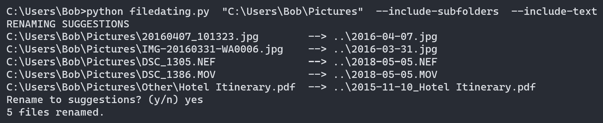

# FileDating

A simple command line tool for automatically renaming image, video and text files.


## Features

- Find date taken or creation date in most common formats (jpg, png, raw, mov, pdf,..)
- Default conversion to ISO-8601 format (e.g. 2015-06-11), can be set to any other format
- Rename photos and videos from WhatsApp or phones/cameras to consistent format
- Find any date information in file names
- Show renaming suggestions before changing file names

## Prerequisites

1. Python 3.6+
2. [Pillow](https://https://pillow.readthedocs.io/en/stable/installation.html): ```pip install pillow```
3. [PyPDF2](https://pypi.org/project/PyPDF2/) (Only required for PDF files): ```pip install pypdf2```

## Usage

Download and run *filedating.py* in a command line with the path of the target folder.

```bash
python filedating.py "C:/users/Bob/Pictures/Italy_2015"
```

### Options

```-n```, ```--new-name <Name>```: Rename files to <Name>.

```-f```, ```--date-format <Format>```: Set custom date format in [strftime format](https://docs.python.org/3/library/datetime.html#strftime-and-strptime-format-codes) (e.g. %Y-%m-%d_%H%M%S)

```-k```, ```--keep-name```: Only add date to current file names.

```-e```, ```--rename-existing```: Rename files even if they already start with date in ISO format.

```-s```, ```--include-subfolders```: Include files in subfolders.

```-t```, ```--include-text```: Include text files (currently only PDF, PyPDF2 library needed).

## License

[MIT](https://choosealicense.com/licenses/mit/)